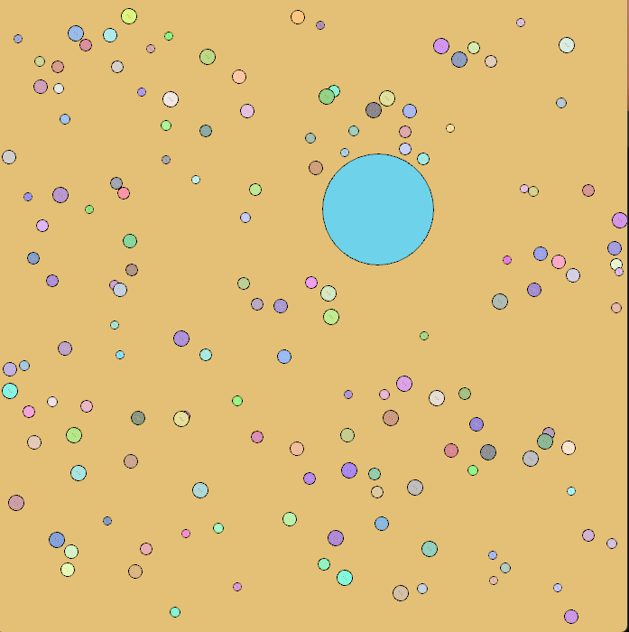

# Particles


**Particles** is a simulation project that models particles (balls) with realistic physical properties such as motion, collision, and response. Built using **Raylib** in C++ and managed with the **CMake** build system, this project provides a simple yet powerful framework for exploring physical simulations.

## Features

- **Realistic Particle Behavior**: Simulates motion, collisions, and interactions based on physical principles.
- **Scalable Environment**: Handles multiple particles with ease.
- **Extensible Codebase**: Designed for easy addition of new features and functionality.


## Technologies Used
- **C++**: For robust and efficient implementation.
- **Raylib**: A simple, open-source library for game development and simulations.
- **CMake**: A cross-platform build system for streamlined project configuration and compilation.


## Getting Started
### Prerequisites

Before you begin, ensure you have the following installed:
- **CMake**: Available at [CMake.org](https://cmake.org/download/).
- A compatible C++ compiler (e.g., GCC, Clang, or MSVC).


### Installation
1. Clone this repository:
   ```bash
   git clone https://github.com/your-username/particales.git
   cd particales
   ```

2. Create a build directory and navigate into it:
   ```bash
    run.bat
   ```


<!--    ::TODO::
## How to Use
### Controls
- **[Key 1]**: Add a new particle to the simulation.
- **[Key 2]**: Increase gravity for all particles.
- **[Key 3]**: Reset the simulation to its initial state.
- Additional controls can be added and customized in the source code. -->


## License
This project is licensed under the MIT License. For more details, see the [LICENSE](LICENSE) file.


Thank you for exploring **Particles**! We hope this project inspires your journey into physics simulations. Feel free to share your feedback and suggestions.

